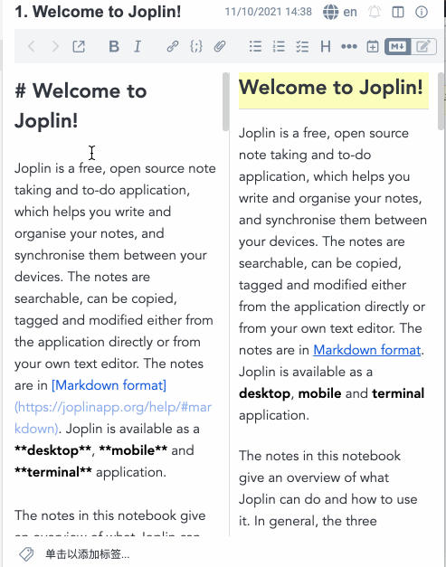
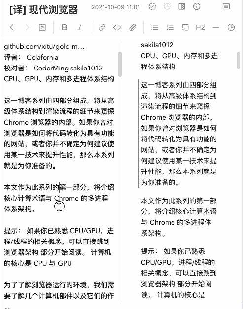
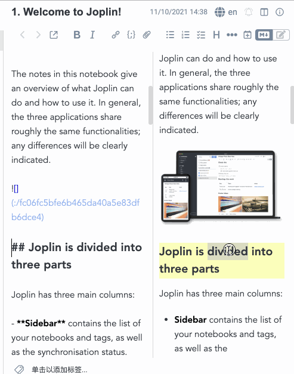
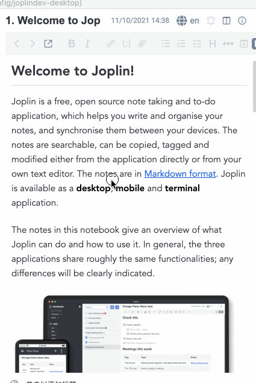

# Joplin Better Markdown Viewer

## Feature 1: Mark the active line of editor in MD Viewer



You can also set the highlight style in [`userstyle.css` of Joplin](https://joplinapp.org/help/#custom-css). For example:

```css
.better-markdown-viewer-highlight-line {
  position: relative;
}
.better-markdown-viewer-highlight-line::before {
  position: absolute;
  background-color: rgba(255, 255, 255, 0.4);
  content: '';
  height: 100%;
  width: 3px;
  left: -6px;
}
```



When using dark theme, the highlighted line element get an extra class name.

```css
.better-markdown-viewer-highlight-line-dark {
  background: red;
}
```

## Feature 2: Focus the same line in editor when double click MD Viewer



When In View Mode:


